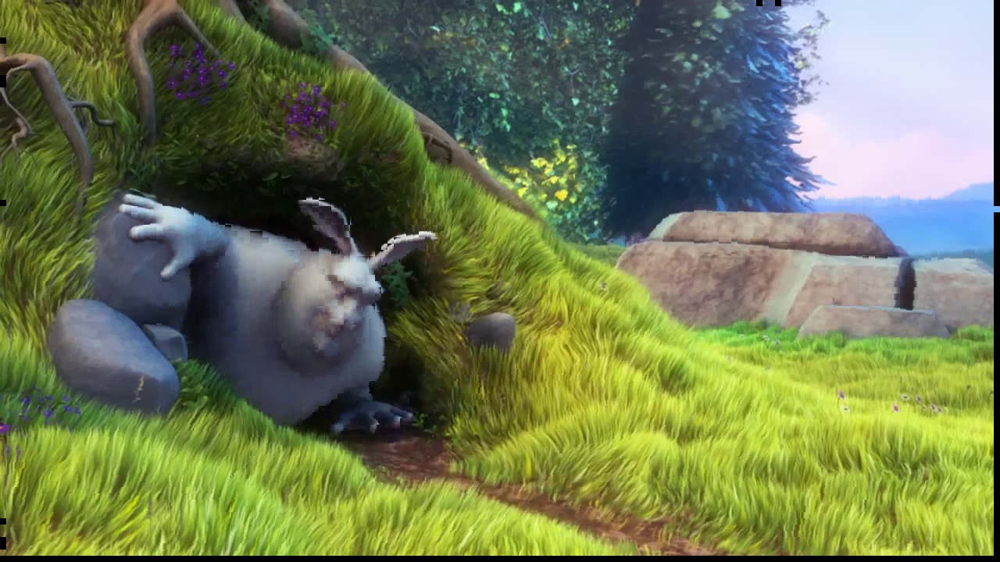

.. _motion:

===========================
Motion
===========================

.. currentmodule:: skvideo.motion

:mod:`skvideo.motion` is a module currently supporting block motion estimation and compensation routines.

Block motion
-----------------------

To estimate a block motion field, simply use :func:`skvideo.motion.blockMotion`

.. code-block:: python

	import skvideo.io
	import skvideo.motion
	import skvideo.datasets

	videodata = skvideo.io.vread(skvideo.datasets.bigbuckbunny())
	
	motion = skvideo.motion.blockMotion(videodata)

	print(videodata.shape)
	print(motion.shape)

Output:

.. code-block:: python

	(132, 720, 1280, 3)
	(131, 90, 160, 2)

By default, :func:`skvideo.motion.blockMotion` uses 8x8 pixel macroblocks and the diamond search algorithm.

Block motion compensation
-------------------------

Use :func:`skvideo.motion.blockComp` to use the computed block motion vectors for motion compensation

.. code-block:: python

	import skvideo.io
	import skvideo.motion
	import skvideo.datasets

	# compute vectors from bigbuckbunny
	videodata = skvideo.io.vread(skvideo.datasets.bigbuckbunny())
	motion = skvideo.motion.blockMotion(videodata)

	# compensate the video
	compmotion = skvideo.motion.blockComp(videodata, motion)

Here is a motion compensated frame from bigbuckbunny 

Global motion estimation
-------------------------

Typically, estimating the global motion (sometimes referred to as ego-motion) is not as simple as averaging the block motion vectors. Many techniques have been devised to estimate global motion robust against moving foreground objects and noise. The function :func:`skvideo.motion.globalEdgeMotion` uses edge-based techniques for estimating global motion, with the option to compute error using either the Hausdorff or Hamming distances.

.. toctree::
    :hidden:
